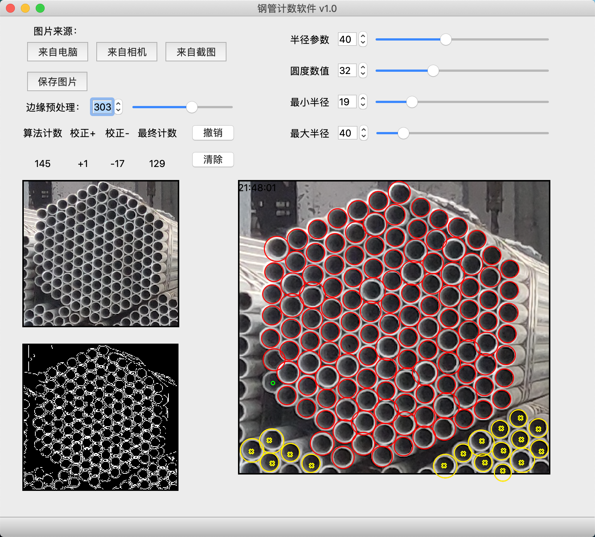
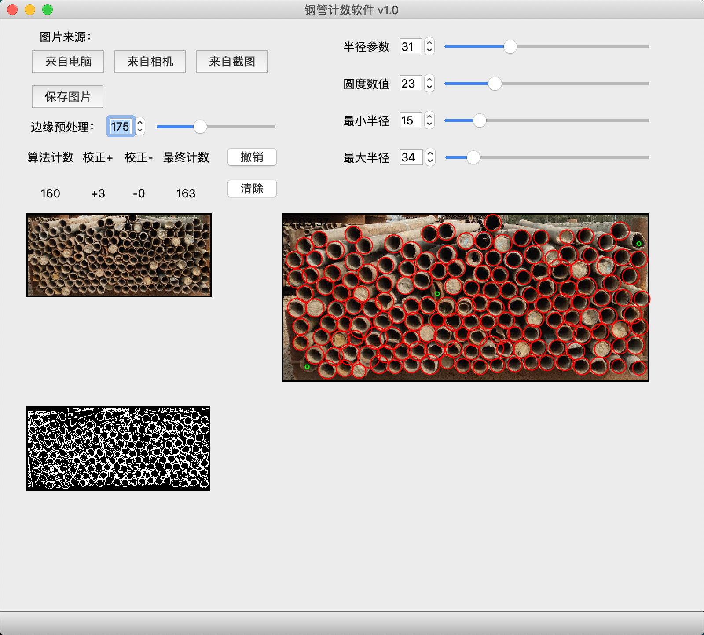

# Qt_PipeCounting

#### Introduction
Project:		Steel Pipe Counting Software   
Language:	C++   
Library:		Qt+OpenCV  
Platform:	MacOS  

#### GUI

 

 

#### Details

**[Background]**
● Successfully deployed in the factory  
● Open-sourced on Github  

**[Demo]**
● Demo redirects to [bilibili ](https://www.bilibili.com/video/BV1Zt4y1y7E7/?spm_id_from=333.337.search-card.all.click)  

**[Function]**
● Software to assist steel pipes counting tasks to get rid of heavy visual fatigue in factories   
● The picture can choose from your computer files, from an independent camera, or even screenshots. What’s more, the final marked picture can be saved  
● To avoid some errors of machine vision in complex cases, the final count can be manually corrected  

**[Realization]**
● Computer Vision: **Hough Transform**   
● Coding: **Qt** (**Cross-platform**), **OpenCV **  
